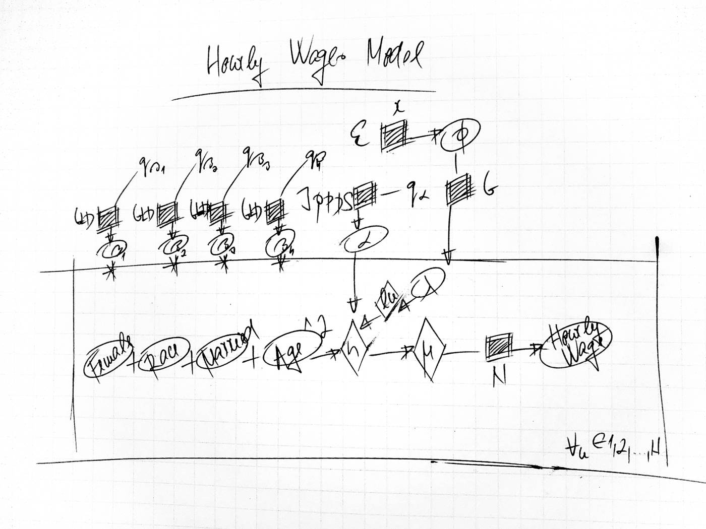

```{r setup, include=FALSE}
knitr::opts_chunk$set(
  echo = TRUE,
  message = FALSE,
  warning = FALSE,
  comment = NA,
  fig.align = "center"
)

library(tidyverse)
library(rstan)
library(rstanarm)
library(bayesplot)
library(loo)

options(mc.cores = max(1L, parallel::detectCores() - 1L))
rstan_options(auto_write = TRUE)
set.seed(42)
```

# 1. Modeling HW with Data from the Current Population Survey (CPS)

This note rebuilds a Bayesian hourly-wage regression with weakly informative priors elicited via quantile-parameterized distributions (GLD / J-QPD helpers in Stan). The directed structure is the simple regression sketched below: log real wages depend on gender, race, marital status, and age (in decades), plus an intercept and Gaussian noise.

```{r dag, echo=FALSE, fig.cap="Hand-drawn model diagram from the original write-up."}

```

Data: CEPR CPS ORG Uniform Extracts (March 2019; see `data/README.md`). Variable names follow the CEPR conventions used in the original project (`rw`, `female`, `wbho`, `married`, `age`).

## 1.1 Prior Predictive Distribution: A Simple Model

```{r expose-gld}
rstan::expose_stan_functions("stan/quantile_functions.stan")
source("R/GLD_helpers.R")

cps_raw <- readr::read_csv("data/cps_cepr_org_2019_march.csv", show_col_types = FALSE)
summary(cps_raw$rw)
```

NB I am recoding the `wbho` variable (Race) to be a Boolean (Non-White) 1/0. That recode is already applied in the extract.

```{r cps-complete}
cps <- cps_raw |>
  filter(!is.na(rw), rw > 0, !is.na(female), !is.na(wbho), !is.na(married), !is.na(age_dec))

nrow(cps)
```

Now, using the theoretical model above — where I think that one’s gender, race, marital status, and age (in decades) have a bearing on one’s hourly wages, plus some intercept and an error term — let’s construct some prior predictive distribution…

```{r gld-priors}
set.seed(42)
# y = m*x + c
# y = alpha + beta*x

# b1/Female = cps$female, b2/Race = cps$wbho, b3/Married = cps$married, b4/Age = cps$age

# Setting up my priors...
# NB Median should be about equidistant between the lower and upper quartiles.
(a_s1 <- GLD_solver(
  lower_quartile = -0.3, median = -0.2, upper_quartile = -0.1,
  other_quantile = 0.2, alpha = 0.9
))
(a_s2 <- GLD_solver(
  lower_quartile = -0.01, median = 0, upper_quartile = 0.01,
  other_quantile = 0.03, alpha = 0.9
))
(a_s3 <- GLD_solver(
  lower_quartile = 0.3, median = 0.5, upper_quartile = 0.65,
  other_quantile = 0.85, alpha = 0.9
))
(a_s4 <- GLD_solver(
  lower_quartile = 0, median = 0.2, upper_quartile = 0.3,
  other_quantile = 0.5, alpha = 0.9
))
```

## 1.2 Drawing from the Prior Predictive Distribution

```{r prior-predictive}
m_alpha <- log(16)
s_alpha <- 0.1 # Normal prior for alpha. At average variable values (x1, x2, x3, x4)...
q_sigma <- c(lower = 0.25, median = 1, upper = 2)

d <- model.matrix(
  log(rw) ~ female + wbho + married + age_dec,
  data = cps
)[, -1]
d <- sweep(d, MARGIN = 2, STATS = colMeans(d), FUN = `-`) # Centering the columns.

n_draws <- 1000L
ppd <- matrix(NA_real_, nrow = nrow(d), ncol = n_draws)
r_squared <- numeric(n_draws)

for (j in seq_len(n_draws)) {
  alpha_ <- rnorm(1, mean = m_alpha, sd = s_alpha)
  sigma_ <- JQPDS_rng(lower_bound = 0, alpha = 0.25, quantiles = q_sigma) # Semi-bounded for sigma.
  beta1_ <- GLD_rng(median = -0.2, IQR = -0.1 - (-0.3), asymmetry = a_s1[1], steepness = a_s1[2])
  beta2_ <- GLD_rng(median = 0, IQR = 0.01 - (-0.01), asymmetry = a_s2[1], steepness = a_s2[2])
  beta3_ <- GLD_rng(median = 0.5, IQR = 0.65 - 0.3, asymmetry = a_s3[1], steepness = a_s3[2])
  beta4_ <- GLD_rng(median = 0.2, IQR = 0.3 - 0, asymmetry = a_s4[1], steepness = a_s4[2])
  mu_ <- alpha_ +
    beta1_ * d[, "female"] +
    beta2_ * d[, "wbho"] +
    beta3_ * d[, "married"] +
    beta4_ * (d[, "age_dec"]^2)
  epsilon_ <- rnorm(n = length(mu_), mean = 0, sd = sigma_)
  y_ <- mu_ + epsilon_
  ppd[, j] <- y_
  r_squared[j] <- stats::var(mu_) / stats::var(y_)
}

summary(r_squared)
round(quantile(c(exp(ppd)), probs = 1:9 / 10), digits = 3)
```

## 1.3 Drawing from the Posterior Distribution

```{r stan-lm, results='asis'}
post <- stan_lm(
  log(rw) ~ female + wbho + married + I(age_dec^2),
  data = cps,
  prior_intercept = normal(location = m_alpha, scale = s_alpha, autoscale = FALSE),
  prior = R2(location = median(r_squared, na.rm = TRUE), what = "median"),
  adapt_delta = 0.99,
  seed = 42,
  refresh = 0
)

print(post, digits = 4)
```

## 1.4 Interpreting the Posterior Coefficients

Coefficients are on the log-wage scale. A negative `female` coefficient means lower expected log wages for women, holding the other covariates fixed; `wbho` (Non-White) is similarly signed in the original write-up; `married` and the quadratic age term pick up the remaining associations. Magnitudes will differ slightly from the 2020 HTML because the CPS vintage differs, but the qualitative pattern is the target.

```{r coef-signs}
posterior_interval(post, prob = 0.9) |>
  as.data.frame() |>
  tibble::rownames_to_column("parameter")
```

Somewhat predictably different, perhaps, in the direction but not so in the magnitude, one might say — relative to the GLD prior medians used above.

```{r bayesplot-areas}
mcmc_areas_ridges(as.array(post), regex_pars = "^[^(]") +
  theme_minimal()
```

```{r pairs-plot, fig.width=7, fig.height=7}
pairs(post, regex_pars = "^[^(lRs]")
```

## 1.5 Model Diagnostics

```{r loo-ppcheck}
loo(post)

pp_check(post, plotfun = "loo_pit_overlay")
```

We see that the model — as is — is often a bit lacking in the lower tail though otherwise seems to fit reasonably. Divergent transitions, if any remain, are mitigated here by a high `adapt_delta` (0.99), as in the original note. If divergences persist below the diagonal in the pairs plot, simplifying the geometry (or reparameterizing age) would be the next modeling step.
